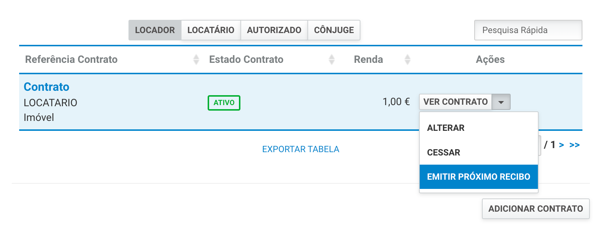

# honesto-proprietário

Chrome extension para proprietários honestos que emitem regularmente recibos de renda no portal das finanças. 

Adiciona uma nova ação na lista de contratos para emitir o próximo recibo mensal e evita a dupla emissão de um recibo para as mesmas datas.

* Verifica recibos anteriores para averiguar quais as datas de inicio/fim do recibo seguinte;
* Inicia o download do novo recibo com o nome `{ano}_{mês}_{locatarios}.pdf`;
* Assume o mesmo valor do último recibo;
* Assume que a data de recebimento é sempre o primeiro dia de cada mês;

